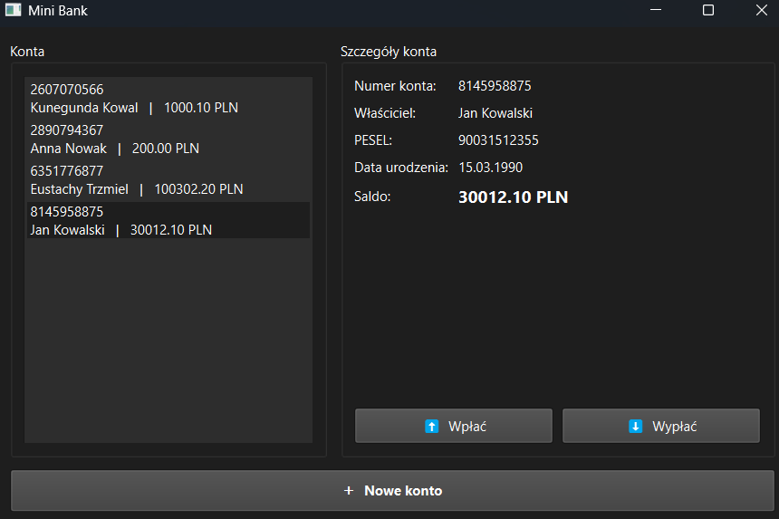
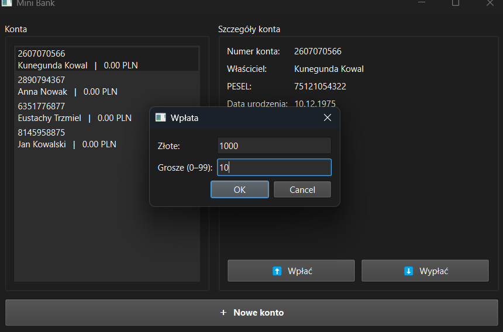
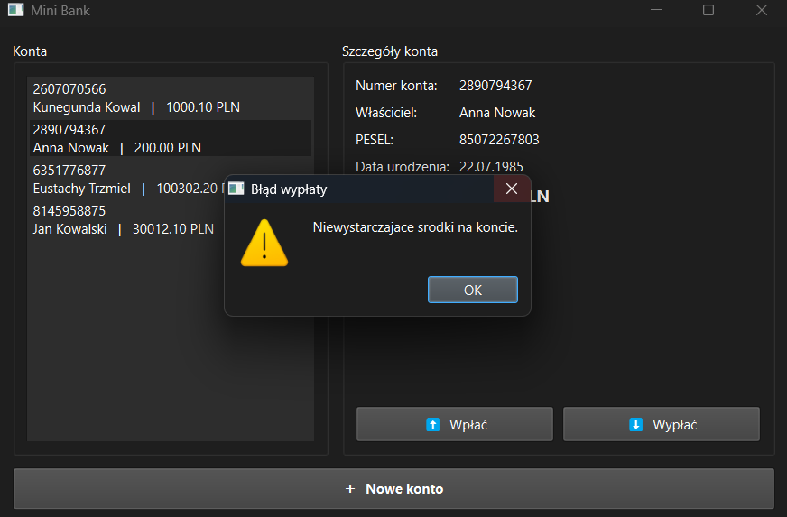
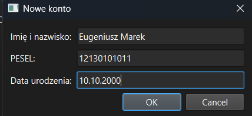
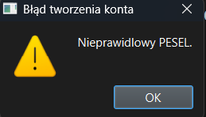

# Mini System Bankowy

Konsolowy + GUI system bankowy napisany w C++17 

## Funkcje

- Tworzenie konta z walidacją PESEL (algorytm sumy kontrolnej), daty urodzenia i unikalności
- Wpłata i wypłata środków
- Wyświetlanie informacji o koncie
- Blokada wypłaty ponad dostępne saldo
- Interfejs graficzny Qt (Qt Widgets)
- Wersja konsolowa jako alternatywny target CMake

## Technologie

- C++17
- Qt 6.10.1 (Widgets)
- CMake 3.16+
- MinGW 13.1.0

## Struktura projektu

```
bank/
├── CMakeLists.txt
├── main.cpp              # punkt wejścia — wersja Qt
├── main_console.cpp      # punkt wejścia — wersja konsolowa
├── core/
│   ├── account.h         # klasa konta bankowego
│   ├── bank.h            # zarządzanie kontami
│   └── validation.h      # walidacja PESEL, daty urodzenia, numeru konta
└── ui/
    ├── mainwindow.h
    └── mainwindow.cpp
```

## Budowanie

### Wymagania

- Qt 6.x z komponentem MinGW 64-bit
- CMake 3.16+

### Wersja Qt (GUI)

```cmd
mkdir build
cd build
set QTFRAMEWORK_BYPASS_LICENSE_CHECK=1
cmake .. -G "MinGW Makefiles" -DCMAKE_PREFIX_PATH="C:/Qt/6.10.1/mingw_64" -DCMAKE_C_COMPILER="C:/Qt/Tools/mingw1310_64/bin/gcc.exe" -DCMAKE_CXX_COMPILER="C:/Qt/Tools/mingw1310_64/bin/g++.exe"
cmake --build .
C:\Qt\6.10.1\mingw_64\bin\windeployqt.exe bank.exe
bank.exe
```

### Wersja konsolowa

```cmd
cmake --build . --target bank_console
bank_console.exe
```

## Komendy Git
Projekt był wersjonowany przy użyciu Git. Historia commitów dostępna w repozytorium:
https://github.com/kacper673/mini-bank/commits/main

## Przykładowe zrzuty ekranu z działania programu

**Główne okno — lista kont i szczegóły:**




**Dialog wpłaty:**




**Blokada wypłaty ponad dostępne saldo:**




**Próba utworzenia konta z nieprawidłowym PESELem:**




**Komunikat błędu walidacji PESELu:**



